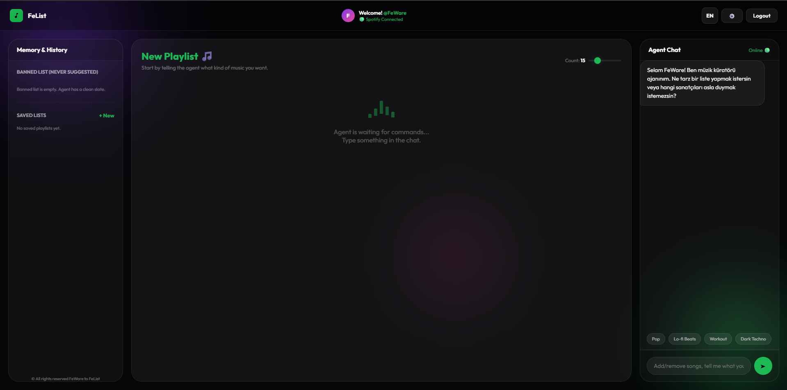
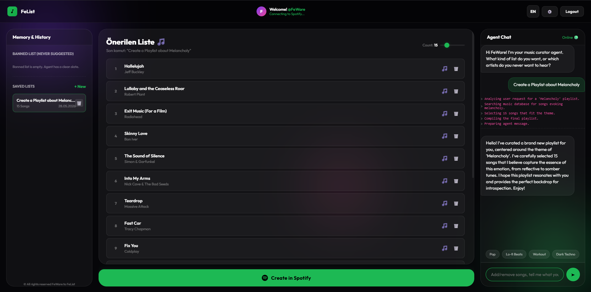
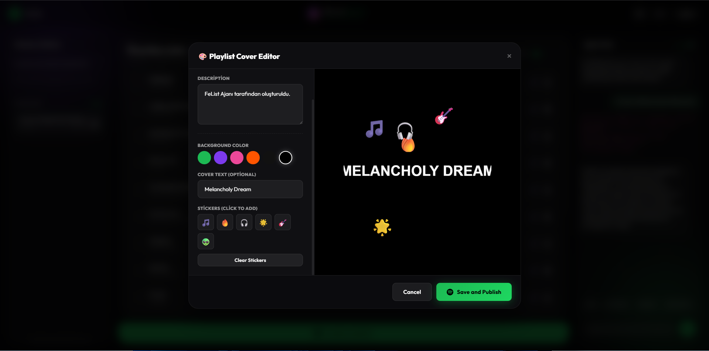
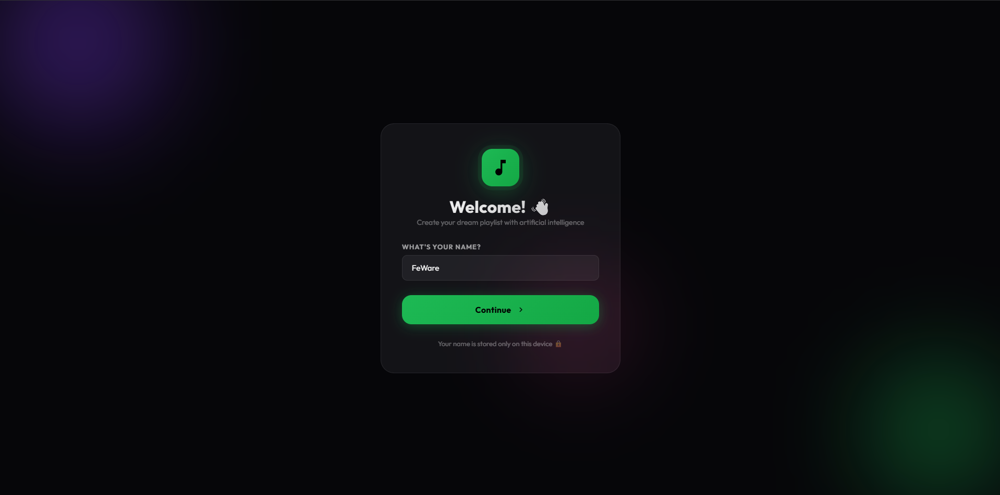
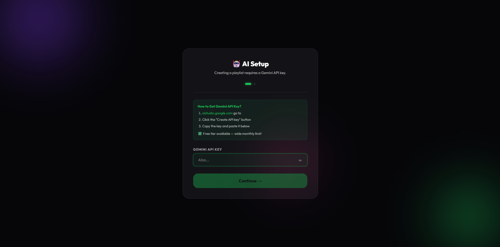
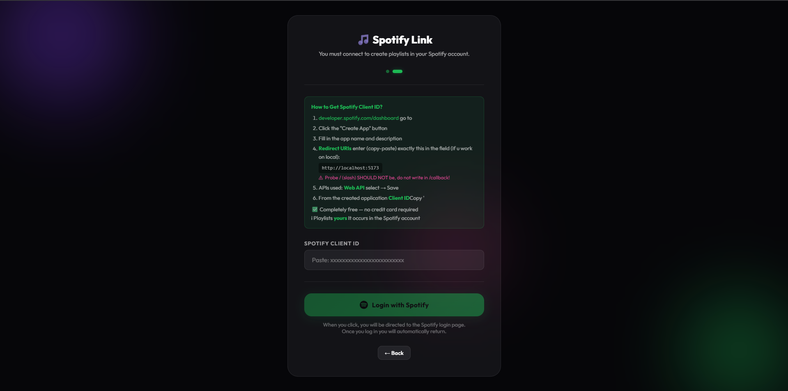

<p align="center">
  
</p>

<p align="center">
  
</p>

<p align="center">
  
  
  
  
</p>

<p align="center">
  
</p>

<br />

<div align="center">

# 🎵 FeList AI

### An AI-powered Spotify playlist maker built by **FeWare**

FeList AI is the open-source web version of **FeWareListAI**.
It helps users generate Spotify playlists based on mood, genre, vibe, language, taste and custom prompts.

</div>

---

## ✨ What is FeList AI?

**FeList AI** is a music-focused AI assistant that creates playlists for your exact vibe.

Instead of manually searching for songs one by one, you can simply tell the agent what kind of playlist you want. FeList analyzes your request, finds fitting songs, builds a playlist and helps you create a Spotify-ready music experience.

> **FeList** stands for **FeWareListAI** — an AI playlist experience developed as part of the FeWare ecosystem.

The web version is open-source on GitHub.
The full **web app + mobile app** version is planned to be released soon.

---

## 🖼️ Preview

<p align="center">
  
</p>

<p align="center">
  <b>Main playlist generation interface</b>
</p>

<br />

<p align="center">
  
</p>

<p align="center">
  <b>Generated playlist result</b>
</p>

<br />

<table>
  <tr>
    <td width="50%">
      
    </td>
    <td width="50%">
      
    </td>
  </tr>
  <tr>
    <td align="center"><b>Playlist cover editor</b></td>
    <td align="center"><b>Welcome screen</b></td>
  </tr>
</table>

<br />

<table>
  <tr>
    <td width="50%">
      
    </td>
    <td width="50%">
      
    </td>
  </tr>
  <tr>
    <td align="center"><b>Gemini API setup</b></td>
    <td align="center"><b>Spotify connection setup</b></td>
  </tr>
</table>

---

## 🚀 Features

* 🤖 AI-powered playlist generation
* 🎧 Spotify-focused playlist creation
* 💬 Chat-based music agent
* 🟢 Spotify account connection flow
* 🧠 Gemini API support
* 🖼️ Playlist cover editor
* 🎨 Custom playlist cover colors and stickers
* 🌙 Modern dark UI
* 🌍 Language-ready interface
* ⚡ Built with Vite
* 🧩 Open-source web version

---

## 🧠 How It Works

FeList AI works like a music curator agent.

You describe what you want:

```txt
I want a Life is Strange style indie folk playlist.
```

Then FeList AI analyzes the request and creates a playlist based on:

* mood
* genre
* atmosphere
* language
* artist style
* user prompt
* playlist length

After generation, you can review the songs, edit the playlist style and continue with Spotify.

---

## 🛠️ Tech Stack

<p align="center">
  
</p>

| Technology    | Usage                           |
| ------------- | ------------------------------- |
| JavaScript    | Main app logic                  |
| Vite          | Frontend development/build tool |
| HTML          | App structure                   |
| CSS           | Styling and responsive UI       |
| Gemini API    | AI playlist generation          |
| Spotify API   | Spotify playlist integration    |
| Local Storage | Saving user setup data          |

---

## ⚙️ Getting Started

Clone and run the project locally:

```bash
git clone https://github.com/Flaxe-max/FeList-AI.git
cd FeList-AI
npm install
npm run dev
```

---

## 🔑 API Setup

FeList AI requires API access for full functionality.

### Gemini API

You need a Gemini API key for AI playlist generation.

1. Go to Google AI Studio.
2. Create an API key.
3. Paste the key into the setup screen.
4. Continue to Spotify setup.

### Spotify API

You need a Spotify Client ID for playlist creation.

1. Go to the Spotify Developer Dashboard.
2. Create a new app.
3. Copy your Client ID.
4. Add this Redirect URI:

```txt
http://localhost:5173
```

5. Paste the Client ID into FeList AI.
6. Login with Spotify.

> The playlist will be created inside your own Spotify account.

---

## 🔐 Security Note

Do not upload private API keys to GitHub.

This repository ignores `.env` files by default.

```gitignore
node_modules/
.env
dist/
build/
```

For local development, keep your keys private and do not hardcode sensitive values into public commits.

---

## 🗺️ Roadmap

* [x] Open-source web version
* [x] AI playlist generation
* [x] Playlist cover editor
* [x] Gemini API setup flow
* [x] Spotify setup flow
* [ ] More advanced recommendation logic
* [ ] Better mobile responsive layout
* [ ] Playlist sharing system
* [ ] Full web app release
* [ ] Mobile app release
* [ ] FeWare account integration
* [ ] More language support

---

## 📱 Coming Soon

FeList AI is currently available as an open-source web version.

The full **FeWareListAI** experience is planned as:

* polished web app
* mobile app
* improved playlist generation
* better Spotify integration
* FeWare ecosystem connection

<p align="center">
  
  
  
</p>

---

## 🤝 Contributing

Contributions are welcome.

You can help by:

* reporting bugs
* suggesting new features
* improving the UI
* optimizing code
* improving documentation
* testing Spotify integration
* improving prompt logic

---

## 📄 License

This project is open-source.

License details will be added soon.

---

## 🧩 About FeWare

**FeWare** is a software and digital project ecosystem focused on building creative tools, games, web apps and experimental products.

FeList AI is one of the projects inside the FeWare ecosystem.

---

<p align="center">
  
</p>

<div align="center">

### Made with passion by **FeWare**

**FeList AI**
AI-powered playlists for your mood.

</div>
